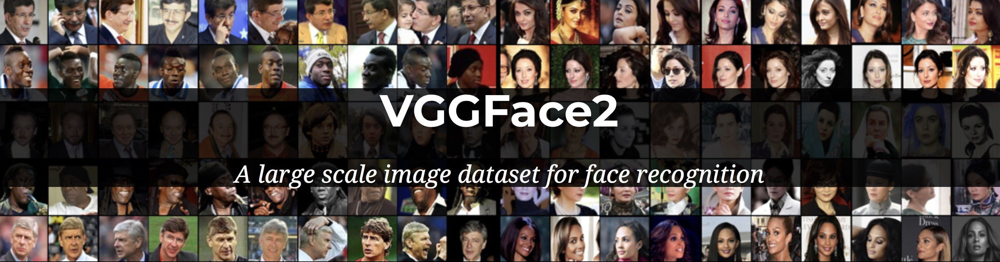
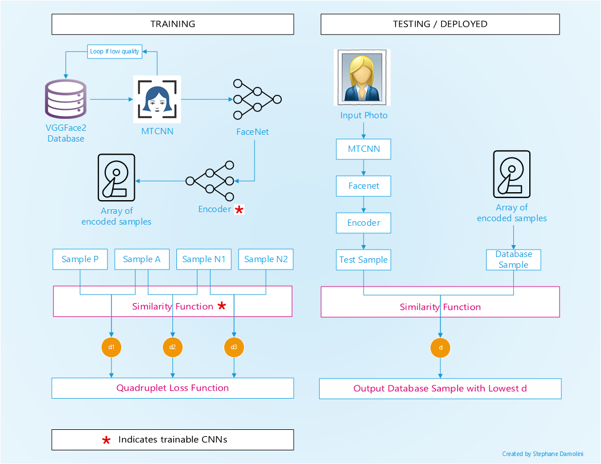
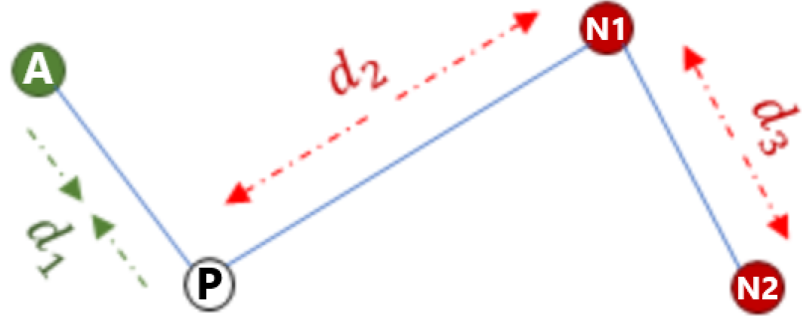
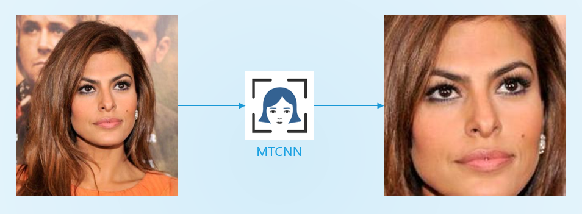
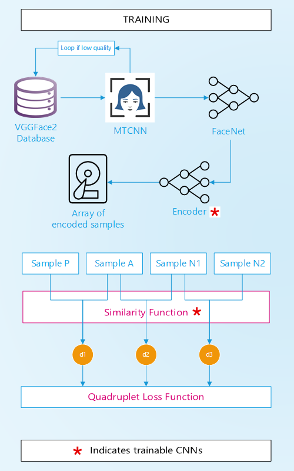
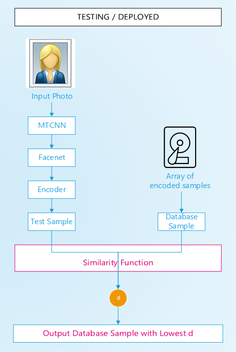
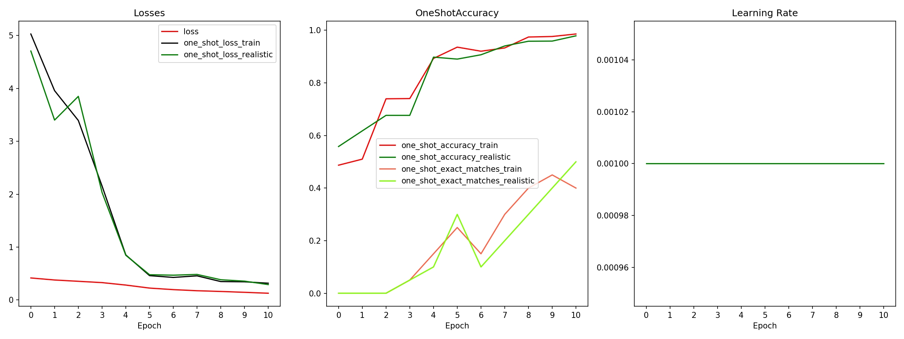
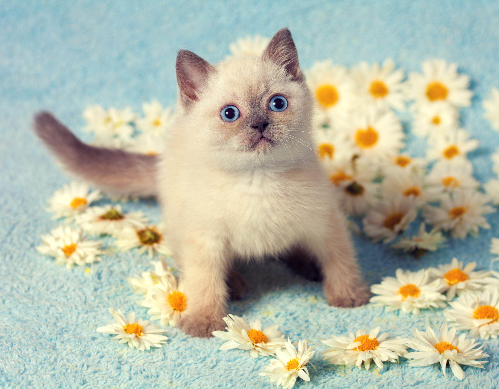

# Introduction

This project presents a face-recognition algorithm that uses 4 distinct Convolutional Neural Networks (CNNs) to recognize more than 9000 celebrities belonging to the VGGFace2 database [1]. A state-of-the-art Siamese net with quadruplet loss is used to efficiently train the model. 

A user-interactive version of this algorithm is deployed to the public on Amazon Web Services (AWS) using Flask. The user uploads a photo containing a face, and the algorithm will output the celebrities with the closest facial features to the input photo. Celebrities can be actors, athletes, politicians, etc. from all around the world. 

>**>> The live version can be accessed here: http://www.lookslikewho.net <<**

# Highlights

- Goal: identify the correct class amongst 9,131 celebrities from a single photo
- State of the art Siamese net using 4 convolutional neural networks: a face-crop, a pre-encoder, an encoder, and a similarity function
- Custom loss layer with efficient quadruplet loss function
- Custom callback with tailored loss and accuracy functions
- App deployment on AWS using Flask, accessible to the public

# Overview

An overview of the architecture is shown below. An executive summary is presented in the next section, and more detailed explanations are provided after that.

# Executive Summary

**Main Goal:**  
Given an image of a celebrity who is included in the VGGFace2 database, identify the name of that celebrity.
  
    
**Alternate goal (as deployed on AWS):**  
For an image of a person who is not in the VGGFace2 database, identify the name of the celebrities that have the most similar face features. 
  
  
**Database:**  
Training and testing is based on the VGGFace2 set [1] containing 9,131 celebrities. For each celebrity, out of the hundreds of photos available, 10 photos are selected for the training and 4 for the testing. Therefore, the train set contains 91,310 samples and the test set contains 36,524 samples.

**Pre-processing of database:**  
Photos are cropped using the MTCNN net [2], and then resized. If the resulting resolution or confidence in cropping is too low, the image is discarded and another image is processed.

**Architecture:**  
Three additional CNNs are used:  

1. **FaceNet CNN:**  
A pre-trained Facenet [3][4] CNN is used to extract features from all the selected train and test images. For each image, a unique vector of shape (128) is generated. This represents the encoding of that image. This step is only performed one time and the encodings are saved on disk.  
   
   
2. **Encoder CNN:**  
A custom CNN is created to refine the embeddings from the Facenet CNN, and tailor them to our dataset and our goal. The input is a vector of shape (128) and the output is also a vector of shape (128).  
  
   
3. **Similarity CNN:**  
A custom CNN is created to compute the similarity scalar between two given input images, encoded through 1 and 2. The similarity scalar is a float between 0 and 1 representing the "distance" between two images. The smaller the number, the more similar the two images. The input is **two** vectors of shape (128) and the output is a scalar vector of shape (1).

  
**Training:**  
Model is trained using the Adam optimizer and a custom Quadruplet Loss. A single input to the model consists of 4 images:
- two images belonging to the same class (same celebrity), one anchor (A) and one positive match (P)
- one image of another class (N1)
- one image from another class (N2) different than the two above classes.  

Three distances (similarities) are computed:
- d1 = ap_dist: distance between the anchor image (A) and the positive image (P) (of the same class)
- d2 = an_dist: distance between the anchor image (A) and the first image (N1) of a different class
- d3 = nn_dist: distance between the two images from different classes N1 and N2 (that do not belong to the anchor class)

The quadruplet loss's goal is to maximize the difference between ap_dist and an_dist, as well as to maximize the difference between ap_dist and nn_dist.

**Evaluation "One v. All":**  
To evaluate the class of an image, the following steps are performed:  
- the image is cropped and resized (unless it's coming from the train or test set, in this case it was already done).
- the FaceNet embeddings of the image are computed (unless it's coming from the train or test set, in this case it was already done).
- the image is compared with all training examples. In extenso, for each of the 91,310 training examples, the distance between the image tested and the training image is computed by feeding the similarity function with the encodings of the two images.
- the class of the image from the training set that has the smallest distance to the tested image is returned. Other methods of selection have been tried, see section 5.6.

**Testing:**  
To evaluate and to tune the performance of the model, several indicators are observed:
- the custom quadruplet loss
- the accuracy of the One v. All approach using two configurations:  
    - One v. All where the tested image comes from the **train** set. While typically we do not perform testing using the train set, in this case it is a little different. While the FaceNet CNN and the Encoder CNN have both "seen" all the images in the train set, the similarity CNN has never computed the distance between two identical images (by design). This allows us to verify that the algorithm and the similarity function performs as intended. An accuracy of 100% is expected early in the training.  
    - One v. All where the tested image comes from the **test** set. This corresponds to a real life situation where the model would have to either identify a celebrity that is in the database, (but with a different photo, which is the main goal), or find the celebrity with the most similar traits to a random person (which is the alternate goal).

# Details

## Dataset and Pre-processing with MTCNN

The database used is VVGFace2 [1]. It contains 9,131 celebrities, each with hundreds of loosely cropped face photos. I created a dataset containing 10 images for the test set, and 4 images for the test set.

Each image from the original dataset is cropped using the MTCNN module, which is in itself a CNN [2]. MTCNN identifies the faces contained in a photo and provide their accurate locations along with other parameters such as the confidence, the eyes and nose positions, etc. 

Because the native image is cropped and there are various zoom levels, the resulting face image often times has a poor resolution. Since the original dataset has so many images compared to the 14 I needed, the selection of the images is performed in a loop as follows:

**LOOP**
- Screen out images with a low resolution
- Run MTCNN
- Screen out images with a low face detection confidence (that number is provided by MTCNN)
- Screen out images with a low cropped resolution
- If an image is screened out, try next image in the subset
- If the end of the set is reached and not enough images were found, start again with decreasing the minimal resolution and confidence required in previous steps. Repeat as needed until enough samples are found.  
  
**END LOOP**  

This ensures a very high quality train and test set, and not a camera roll from a 2004-era flip phone. While this does not necessarily improve the model accuracy (poor quality images may actually add some regularization to the model), it allows the app to display to the user high-quality photos of their exact match. 

See `get_what_from_full_set_with_face_crop` function for the full code.

## Encoding

### Facenet

I tested several pre-trained neural networks: MobileNetV2, ResNet50, VGG16, InceptionV3, Xception, and FaceNet. With the exception of Facenet, all these nets were pre-trained on ImageNet, which is an image database containing animals, plants, tools, etc. While the algorithms may be performant on ImageNet, face recognition was poor because of the set it was trained on (surprise, surprise!). Another option is to retrain the model from the pre-trained state, or even to completely retrain the model on VGGFace2, which would have been feasible with higher computer resources. 

Facenet [3] CNN was originally trained on the Microsoft Celeb (MS-Celeb-1M) [6]. It is therefore the best candidate and it is used to extract features from all the selected train and test images. A keras-adapted pre-trained version is used herein [4].

For each image, a unique vector of shape (128) is generated. This represents the encoding of that image. This step is only performed one time and the encodings are saved on disk.  

### Encoder

A second custom CNN is created to refine the embeddings from the Facenet CNN tailoring them to our dataset and our goal. The input is a vector of shape (128) and the output is also a vector of shape (128).  

The encoder has the following layers:
- An input layer of shape (128)
- A dropout layer (rate=0.3)
- A dense output layer with 128 units.

See `build_network` function for the full code.

## Similarity Function

The similarity function is another CNN created to compute the similarity scalar between two given input images, enocoded through FaceNet and the encoder. The similarity scalar is a float between 0 and 1 representing the "distance" between two images. The smaller the number, the more similar are two images. The input is **two** vectors of shape (128) and the output is a scalar of shape (1).

A basic similarity function would be to simply subtract the encodings of the first vector from the encodings of the second vector. I have also tried other various arithmetic operations such as concatenation including the Hadamard product, as discussed in see Section 3.3.1. of "Siamese Convolutional Neural Networks for Authorship Verification" [7].

However, I chose a more conventional architecture to include non-linearity to achieve higher performance at a cost of more trainable parameters.

The chosen architecture is:

- An input layer of size 256 (2 vectors of size 128)
- A dense layer with 30 units and a relu activation
- A dense layer with 20 units and a relu activation
- A dense layer with 10 units and a relu activation
- A dense output layer with 1 unit and a sigmoid activation.

See `build_metric_network` function for the full code.

## Training

Model is trained using the Adam optimizer and a custom Quadruplet Loss. A single input to the model consists of 4 images:
- two images belonging to the same class (same celebrity), one anchor (A), and one positive match (P)
- one image of another class, N1
- one image from another class different than the two above classes, N2.

Three distances (similarity) are computed:
- d1 = ap_dist: distance between the anchor image (A) and the positive image (P) (of the same class)
- d2 = an_dist: distance between the anchor image (A) and the first image of a different class (N1)
- d3 = nn_dist: distance between the two images from different classes N1 and N2 (that do not belong to the anchor class)

The quadruplet loss's goal is to maximize the difference between ap_dist and an_dist, as well as to maximize the  difference in distance between ap_dist and nn_dist.

The exact quadruplet loss is expressed by:

**max(ap_dist² - an_dist² + alpha, 0) + max(ap_dist² - nn_dist² + beta, 0)**

Alpha and beta are two margin parameters. They force the model to optimize itself such that ap_dist2 is greater than an_dist2 (or nn_dist2) by at least a margin alpha (or beta). If not, the loss won't be zero. 

Based on that computed loss, the model optimizes the weights of the encoder and the similarity CNNs.

## Evaluation - One v. All approach

To predict the class of an image, the following steps are performed:

**Testing during training:**
- a selected test image is compared with every single training example. In extenso, for each of the 91,310 training examples, the distance between the image tested and the training image is computed by feeding the similarity function with the encodings of the two images (that are already computed)
- the class of the image from the training set that has the smallest distance to the tested image is returned.
- that class is compared to the ground truth class of the test image
- an accuracy score is computed

**Evaluation from a user inputted image:**

- the image is cropped and resized. If the image cannot be cropped by MTCNN, an error message is displayed.
- the FaceNet embeddings of the image are computed and refined with the encoder
- the image is compared with every training example. In extenso, for each of the 91,310 training examples, the distance between the image tested and the training image is computed by feeding the similarity function with the encodings of the two images.
- the class of the image from the training set that has the smallest distance to the tested image is returned.
- that class is returned to the user, along with the photo that yielded the smallest distance.

## Testing and tuning

### Performance

To reduce training times, the model was trained and tuned on smaller datasets:
- "Lite": 10 classes, 4 images per class for the train and test set
- "Medium": 100 classes, 4 images per class for the train and test set
- "Medium_10": 100 classes, 10 images per class for the train and test set
- "Full_4": 9,131 classes, 4 images per class for the train and test set
- "Final": 9,131 classes, 10 images per class for train set and 4 images per class for the test set.

The following parameters were fine-tuned:
- Alpha and Beta margins (quad loss calculation)
- Encoder:
    - Output size
    - Number and size of layers
    - Dropout ratio
    - Activation function
- Similarity function:
    - Custom arithmetic operations (see Section 5.3)
    - Size of layers
    - Activation function
- Selection method: the algorithm selects the class of the image with the smallest distance to the test image. I have tested other methods, including averaging the smallest n results from each class (n=2, 3, 4) and selecting the class with the smallest average. This method was adding additional computation time for a marginal gain in accuracy, so it was discarded (it is still in the code if needed! See the "method" argument of *SLD_models.make_prediction_quad*).
    
    

For smaller datasets, the ones containing 10 and 100 classes, an accuracy of near 100% is attained. For the full training set comprising of 9,131 classes, an accuracy of 40-50% was obtained (for exact matches). It is noted that after ranking all predicted classes by their probability, it is observed than when the model predicts the wrong class, the ground truth class is usually in the very first following predictions.

While an accuracy of 50% would be unacceptable for a system like an employee identification, it is sufficient for our web application aiming to recognize who you like like. There are no consequences of a mismatch (besides a slight ego bruise).

### Increasing Performance Onwards

Potential routes for increasing accuracy include:
- Increasing the number of layers of the encoder. Due to a unstable hardware situation (see Notes 6.1), I wasn't able to increase the number of layers past three
- Make the FaceNet trainable. I believe that would have the most significant improvement in the accuracy of the model
- Add regularization by augmenting the training sample images (mirroring, deformations, scaling, rotations, etc.) and/or using more training images.
- Increasing the size of the train set. Right now, only 4 to 10 images are used per class, but there are hundreds available. Significant improvement is expected.
- Mining: carefully selecting training samples that are "hard" so the model can learn better. For instance, two photos of the same person, one being a profile view and the other being a portrait, would constitute a hard exmaple. See [10] for more details.

## Deployment on AWS

The app is deployed on an Amazon Web Services (AWS) t2.micro EC2 instance, running Ubuntu 18.04. This server comes at no cost for one year, as part of the Amazon free tier (maybe that makes up for my massive spending on Amazon.com in the last ten years? Not even close). See https://aws.amazon.com/free/ for more info.

The app is deployed using Flask [8].

Everything needed to run the app is stored on a AWS 30GB Elastic Block Store (EBS), which is attached to the EC2 instance. Data includes amongst others:
- the website (html+css)
- the app in Python
- the encodings of the train set for prediction
- the entire train data set for returning prediction images to the user

# Notes

## Building Tensorflow-GPU from source

Training using Tensorflow-GPU was delicate on my machine due to an older graphic card, a Nvidia GeForce GTX 660M. While that graphic card is technically compatible with tf-gpu, the "compute capability" score of the card was too low at 3.0. Only cards with a score equal or greater than 3.5 are officially supported.

The workaround for this situation is to ~~buy a new computer~~ install tensorflow-gpu directly from the source, and allow a compute capability as low as desired. The procedure is described in https://www.tensorflow.org/install/source.

Even after the card was "made" compatible, the low amount of memory in that graphic card made training difficult. This resulted in a less-complex encoder net and a less-than-optimal batch size.

## Increasing RAM in AWS

I created a 4GB swap file on my AWS instance to resolve out-of-memory issues. I use the following procedure: https://aws.amazon.com/premiumsupport/knowledge-center/ec2-memory-swap-file/.

I later reduced the dimension of certain numpy arrays to not have to rely on that swap space (note to self: never use one-hot encoded m x n label matrices). 

# Source Code

Full code is available here: https://github.com/sdamolini/LooksLikeWho. Some parts of the code, especially the loss layer, is adapted from [10]. [9] was another useful resource. Special thanks to my friend Thibault [11] for his support and mentorship.

The live version can be accessed here: www.LooksLikeWho.net

# Conclusion

A state-of-the-art Siamese net with quadruplet loss is presented. The model is capable of recognizing more than 9000 celebrities belonging to the VGGFace2 database [1].

A user-interactive version of this algorithm is deployed to the public on Amazon Web Services (AWS) using Flask, and can be accessed at: http://www.lookslikewho.net.

The algorithm has a robust and customizable architecture that can be enhanced and tailored as needed. Areas of improvements are discussed in Section 5.6.2.

# References

1. VGGFace2, https://github.com/ox-vgg/vgg_face2
2. MTCNN, https://github.com/ipazc/mtcnn
3. FaceNet, https://arxiv.org/abs/1503.03832?context=cs
4. Facenet implementation in keras, https://github.com/nyoki-mtl/keras-facenet
5. Neural Network by Med Marki from the Noun Project
6. Microsoft Celeb (MS-Celeb-1M), https://www.microsoft.com/en-us/research/wp-content/uploads/2016/08/MSCeleb-1M-a.pdf
6. Siamese Convolutional Neural Networks for Authorship Verification, Du et al., http://cs231n.stanford.edu/reports/2017/pdfs/801.pdf
0. Flask, https://flask.palletsprojects.com/en/1.1.x/
7. One Shot Learning with Siamese Networks using Keras, https://towardsdatascience.com/one-shot-learning-with-siamese-networks-using-keras-17f34e75bb3d
8. Beyond triplet loss : One shot learning experiments with quadruplet loss, https://medium.com/@crimy/beyond-triplet-loss-one-shot-learning-experiments-with-quadruplet-loss-16671ed51290
9. Thibault Dody, https://www.linkedin.com/in/thibault-dody

Thanks for reading!
